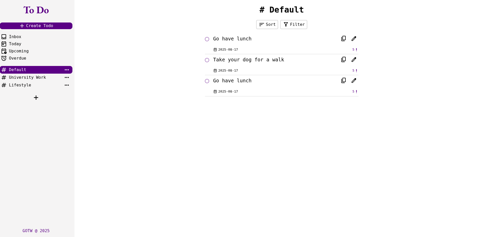

# Todo List App

A feature-rich todo list application built with vanilla JavaScript. Manage your tasks with multiple projects, custom priorities, due dates, and a clean, modern interface.



## 🔴 [Live Demo](https://g-o-t-w.github.io/todo/)

## Features

- **Project Management**
  - Create multiple projects to organize todos
  - Rename and delete projects
  - Default project included

- **Todo Management**
  - Create todos with title, description, due date, and priority
  - Edit existing todos
  - Copy todos within projects
  - Mark todos as complete with smooth animations
  - Persistent storage using localStorage

- **User Interface**
  - Clean, modern design with custom styling
  - Responsive sidebar navigation
  - Custom checkbox animations
  - Modal dialogs for creating/editing todos
  - Interactive dropdowns for project actions

## Work in Progress

The following features are currently under development:

- Sort functionality
- Filter functionality
- Inbox view
- Today view
- Upcoming view
- Overdue view

## Technologies Used

- JavaScript (ES6+)
- CSS3 with custom properties
- HTML5
- Webpack for bundling
- LocalStorage for data persistence
- Google Material Icons

## Getting Started

### Prerequisites

- Node.js and npm installed on your system

### Installation

1. Clone the repository

```bash
git clone https://github.com/yourusername/todo.git
```

2. Navigate to project directory

```bash
cd todo
```

3. Install dependencies

```bash
npm install
```

4. Start development server

```bash
npm start
```

### Building for Production

```bash
npm run build
```

## Contributing

1. Fork the project
2. Create your feature branch (`git checkout -b feature/AmazingFeature`)
3. Commit your changes (`git commit -m 'Add some AmazingFeature'`)
4. Push to the branch (`git push origin feature/AmazingFeature`)
5. Open a Pull Request

## License

This project is licensed under the MIT License - see the [LICENSE](LICENSE) file for details.

## Acknowledgments

- The Odin Project for project inspiration and guidance
- Google Material Icons
